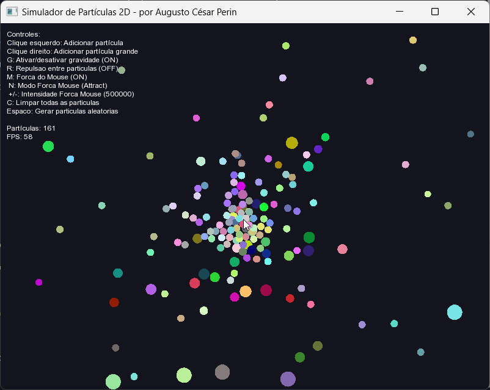

# Simulador de Partículas

Um simulador de partículas numa janela com algumas migalhas de física implementada. Feito para explorar C++ e SFML, não para ciência de ponta.

## Funcionalidades

*   **Partículas (`Particle`):**
    Círculos com `massa`, `raio`, `posição`, `velocidade` e `cor`. Massa e raio afetam colisões e gravidade.

*   **Sistema de Partículas (`ParticleSystem`):**
    Gerencia as partículas: cria, remove, aplica forças (gravidade), trata colisões e atualiza os estados (`deltaTime`).

*   **Interações Físicas:**
    *   **Gravidade:** Aceleração vertical constante (ajustável, liga/desliga).
    *   **Colisões:** Detecção por sobreposição de círculos; resolução elástica básica com correção de posição.
    *   **Repulsão entre Partículas:** Força entre pares, baseada no inverso do quadrado da distância (ajustável, liga/desliga).
    *   **Força do Mouse:** Atração ou repulsão de partículas em relação à posição do mouse (ajustável, liga/desliga).

## Interação

*   **Mouse:**
    *   `Clique Esquerdo`: Partícula padrão.
    *   `Clique Direito`: Partícula maior/pesada.
    *   `Posição`: Centro de atração/repulsão quando a força do mouse está ativada.
*   **Teclado:**
    *   `G`: Liga/desliga gravidade.
    *   `R`: Liga/desliga repulsão entre partículas.
    *   `M`: Liga/desliga força do mouse.
    *   `N`: Alterna entre atração e repulsão do mouse.
    *   `+/-`: Ajusta intensidade da força do mouse.
    *   `C`: Limpa partículas.
    *   `Espaço`: Gera partículas aleatórias.
    *   `ESC`: Sai.

## Run

*   **Requisitos:** C++ (11+), SFML (>=2.5).
*   Use o arquivo executável `ParticleSimulator.exe` ou compile com `compile.bat`.

## Considerações

Performance pode variar com muitas partículas/interações - Use por sua conta e risco.

~Na minha máquina funciona~
