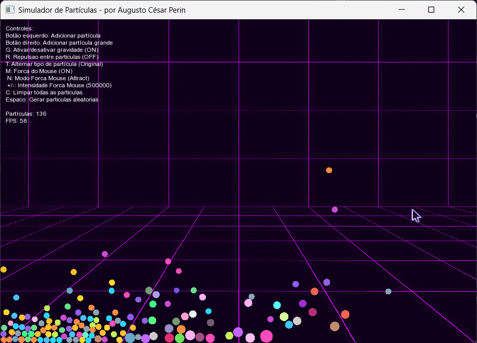

# Particle Simulator

A simulator with some physics. Made to play around with C++ & SFML, and, who knows, use it in future projects that probably won't happen.


<br>


<br>

## Verlet

The simulator uses Verlet integration for movement calculations. Unlike the Euler method (used in the initial versions), the Verlet method prevents particles from passing through each other when they're moving fast, or when the FPS drops. The system also simulates energy loss in collisions, preventing particles from bouncing around like there's no tomorrow.
In summary: Verlet method doesn't just consider current position and velocity, but also remembers previous position and acceleration to predict where the particle should be, as if each particle had a "memory". This makes movements smoother and more realistic.

## Controls

**Mouse:**
- Left button: creates normal particle
- Right button: creates heavy particle

**Keyboard:**
- `G`: toggles gravity
- `R`: toggles repulsion
- `L`: toggles particle collisions
- `M`: toggles mouse force
- `N`: switches between attract and repel
- `F`: Toggles mouse force style
- `+/-`: adjusts force intensity
- `C`: clears all particles
- `Space`: creates random particles
- `T`: Toggles particle visual type (Original/Crystal)
- `K`: Cycles through different cursor types
- `S`: Shows/hides on-screen instructions
- `I/U`: Increases/decreases particle bounciness
- `ESC`: exits

### Compile:
```
compile.bat
```

### Run:
```
ParticleSimulator.exe
```

**Requirements:** C++ 11+ and SFML 2.5+

Performance may vary with many particles/interactions - Use at your own risk.

~Works on my machine~

<details>
<summary>Older Versions</summary>

#### v0.5


#### v0.1


</details>

<div align="right">
  <sub><a href="https://github.com/augustoperin">Augusto Cesar Perin</a> | 2018-2019</sub>
</div>