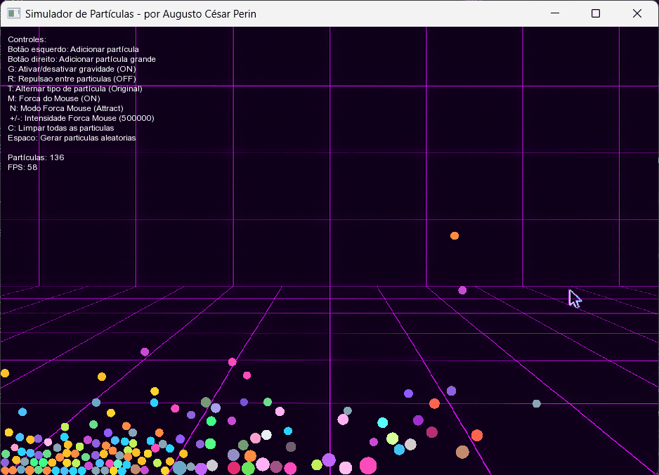

<div align="right">🇺🇸 <a href="README.md">Read in English</a></div>

Uma engine com algumas migalhas de física e muitas otimizações. Feito para fins didáticos e procrastinatórios em C/C++ & SFML.

<p align="center">
  
</p>

## Integração Verlet


O programa usa integração de Verlet para os cálculos de movimento. Diferente do método Euler (usado nas versões iniciais), o método Verlet evita que as partículas atravessem umas às outras quando estão em alta velocidade, ou quando o FPS cai muito. O sistema também simula perda de energia nas colisões, e evita que elas fiquem ricocheteando ad infinitum.

## Otimizações

-   Spatial Grid
-   Object Pooling
-   Structure of Arrays (SoA)

## Controles

**Mouse:**
- Botão esquerdo: cria partícula normal
- Botão direito: cria partícula grande

**Teclado:**
- `G`: liga/desliga gravidade
- `R`: liga/desliga repulsão
- `M`: liga/desliga força do mouse
- `N`: alterna entre atrair e repelir
- `F`: Troca o estilo de força do mouse
- `+/-`: ajusta intensidade da força
- `C`: limpa todas as partículas
- `Espaço`: cria partículas aleatórias
- `ESC`: bye


### Windows
```
compile.bat
```
> É necessário ter o [MSYS2](https://www.msys2.org/) com as ferramentas MinGW (g++, make, cmake) e SFML instalados e no PATH do sistema.

### Linux
```sh
sudo apt update && sudo apt install build-essential git cmake libsfml-dev

git clone https://github.com/augustocesarperin/chaos-engine.git
cd chaos-engine
mkdir build && cd build
cmake ..
make
./Chaos
```

Apesasar de otimizado, o desempenho pode variar com muitas partículas/interações. Use por sua conta e risco.

(~Funciona na minha máquina~)

### Versões Antigas

<p align="center">
  <b>v0.5</b><br>
  
</p>
<p align="center">
  <b>v0.1</b><br>
  
</p>

<div align="right">
  <sub><a href="https://github.com/augustocesarperin">Augusto Cesar Perin</a> | 2018-2019</sub>
</div>

